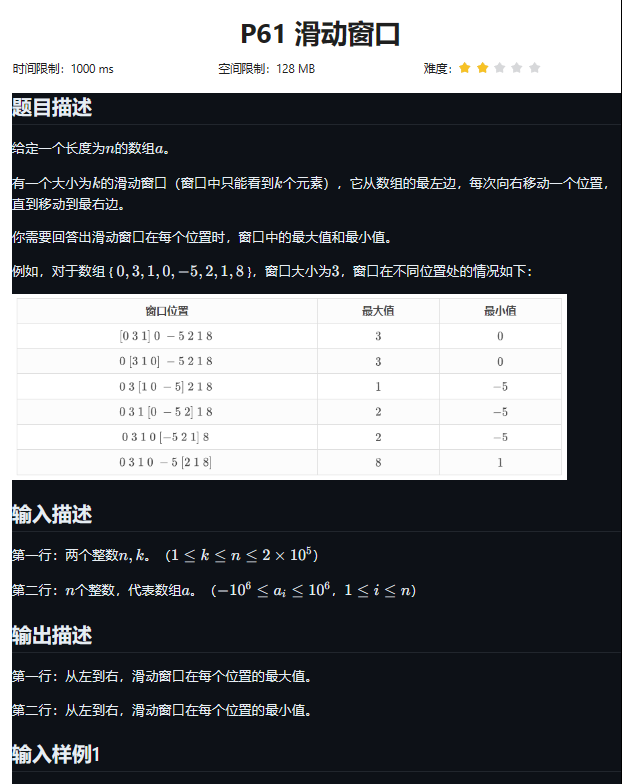
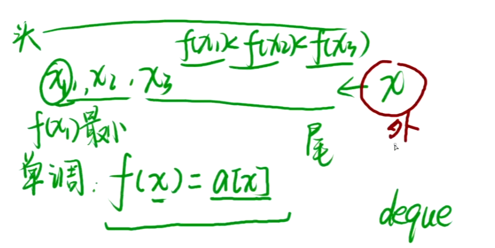

```
#include <bits/stdc++.h>
using namespace std;
using ll=long long;

const int N = 2e5+9;

int a[N],dq[N];//dq 中保持着窗口内最大/最小元素的索引,因为后续条件让其只保持一个

void solve()
{
	int n,k;cin>>n>>k;
	for(int i=1;i<=n;i++)cin>>a[i];
	
	int hh=0,tt=-1;
	
	//求最大
	for(int i=1;i<=n;i++)
	{
		//以i为右端点,大小k的区间.[i-k+1,i]
		
		//1.队头的合法性
		while(hh<=tt && dq[hh] <= i-k)hh++;//表示队头元素已经超出了当前窗口的范围
		//2.队尾的优越性
		while(hh<=tt && a[dq[tt]] <= a[i])tt--;// a[dq.front()] 数组 a 中索引为 dq.front() 的元素的值。
															//dq.front() 队列 dq 中的第一个元素的索引
															//此循环保证dq单调减,front最大	,且pop从后往前
		dq[++tt]=i;
		
		if(i>=k)cout<<a[dq[hh]]<<' ';
	}
	cout<<'\n';
	
	hh=0;tt=-1;
	
	//求最小
	for(int i=1;i<=n;i++)
	{
		while(hh<=tt && dq[hh] < i-k+1)hh++;
		while(hh<=tt && a[dq[tt]] >= a[i])tt--;
		
		dq[++tt]=i;
		
		if(i>=k)cout<<a[dq[hh]]<<' ';
	}
	
}

int main()
{
	ios::sync_with_stdio(0),cin.tie(0),cout.tie(0);
	
	int _=1;
	while(_--)solve();
	return 0;

}
```


```
\#include <bits/stdc++.h>

using namespace std;
using ll=long long;

const int N = 2e5+9;

int a[N];

void solve()
{
	int n,k;cin>>n>>k;
	for(int i=1;i<=n;i++)cin>>a[i];

	deque<int> dq;//dq 中保持着窗口内最大/最小元素的索引,因为后续条件让其只保持一个

	//求最大
	for(int i=1;i<=n;i++)
	{
		//以i为右端点,大小k的区间.[i-k+1,i]
		//1.队头的合法性
		while(dq.size() && dq.front() <= i-k)dq.pop_front();//表示队头元素已经超出了当前窗口的范围

		//2.队尾的优越性
		while(dq.size() && a[dq.back()] <= a[i])dq.pop_back();// a[dq.front()] 数组 a 中索引为 dq.front() 的元素的值。

															//dq.front() 队列 dq 中的第一个元素的索引

															//此循环保证dq单调减,front最大	,且pop从后往前
		dq.push_back(i);
		
		if(i>=k)cout<<a[dq.front()]<<' ';
	}
	cout<<'\n';

	dq = deque<int>();//清空

	//求最小
	for(int i=1;i<=n;i++)
	{
		while(dq.size()&&dq.front()<i-k+1)dq.pop_front();
		while(dq.size()&&a[dq.back()]>=a[i])dq.pop_back();

		dq.push_back(i);

		if(i>=k)cout<<a[dq.front()]<<' ';
	}
}

int main()
{
	ios::sync_with_stdio(0),cin.tie(0),cout.tie(0);
	
	int _=1;
	while(_--)solve();
	
	return 0;
}
```

****


