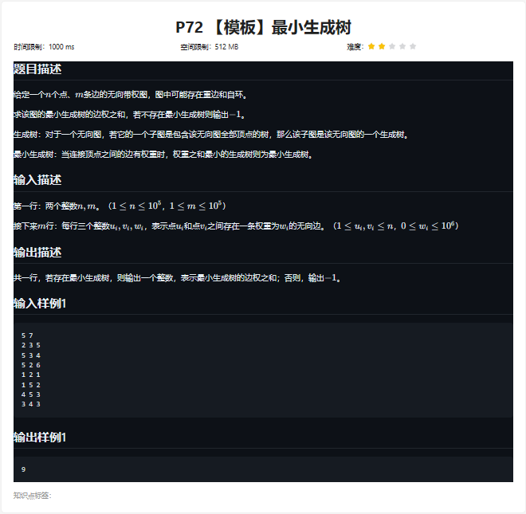

```
#include <bits/stdc++.h>
using namespace std;
using ll=long long;
const ll N=1e5+5;

struct Edge
{
	ll u,v,w;//u边的起点、v终点和w权重
	
	bool operator<(const Edge &m)const//重载升序排列
	{
		return w<m.w;
	}
};

ll d[N];
//并查集
int pre[N];//并查集的根节点
int root(int x)查找节点 x 的根节点，路径压缩优化
{return pre[x]= (pre[x]==x ? x : root(pre[x]));}//当前节点的父节点直接指向根节点，以减小树的高度。

void solve()
{
	ll n,m;cin>>n>>m;
	
	memset(d,0x3f,sizeof d);
	
	vector<Edge> es;//存储边的向量 es
	for(ll i=1;i<=m;i++)
	{
		ll u,v,w;cin>>u>>v>>w;
		es.push_back({u,v,w});
	}
	
	sort(es.begin(),es.end());//按照权重升序排列
	
	ll ans=0;
	for(ll i=1;i<=n;i++)pre[i]=i;//并查集初始化
	
	for(auto &[u,v,w]:es)
	{
		if(root(u)==root(v))continue;//u 和 v 在同一个连通分量
		// u 和 v 不在同一个连通分量中将其加入最小生成树，并将它们所在的连通分量合并
		ans+=w;
		pre[root(u)]=root(v);
	}
	
	//通过检查节点 1 到节点 n-1 是否属于同一个连通分量
	for(ll i=1;i<n;i++)if(root(i)!=root(i+1))ans=-1;
	
	cout<<ans<<'\n';
}

int main()
{
	ios::sync_with_stdio(0),cin.tie(0),cout.tie(0);
	
	int _=1;
	while(_--)solve();
	return 0;
}
```

